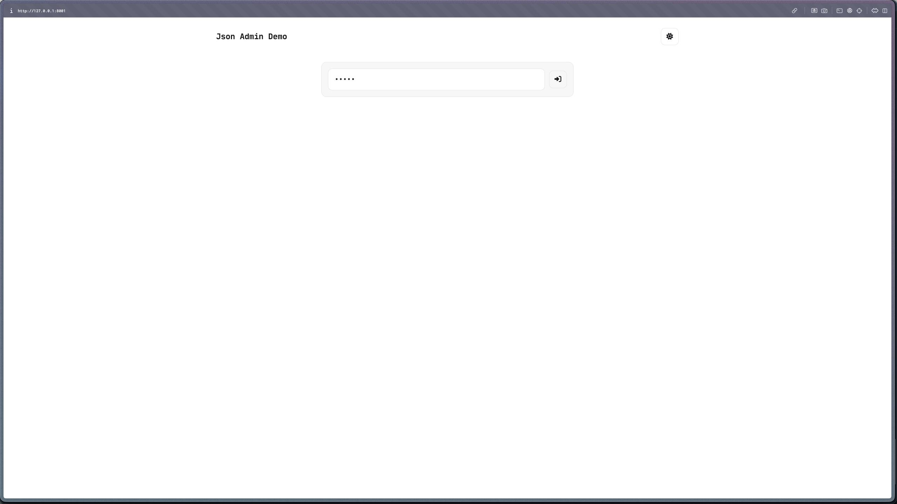
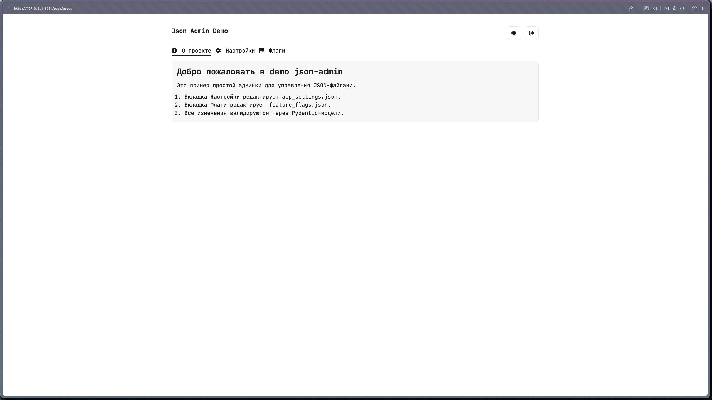
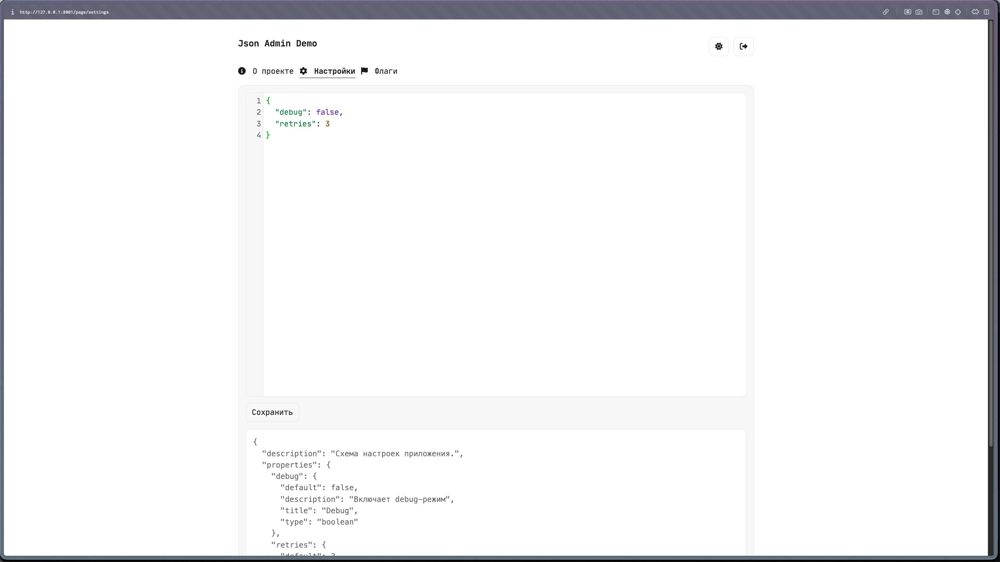

# Json-admin

Библиотека с реализацией простого интерфейса для управления .json-файлом с настройками приложения.

## Установка

```bash
uv add json-admin
```

```bash
poetry add json-admin
```

```bash
pip install json-admin
```

## Быстрый старт

```python
from litestar import Litestar
from pydantic import BaseModel, Field

from jsonadmin import Admin, HtmlPage, JsonPage


class AppSettings(BaseModel):
    """Настройки приложения."""

    debug: bool = Field(default=False, description="Включает debug-режим")
    retries: int = Field(default=3, ge=0, description="Количество повторных попыток")


class FeatureFlags(BaseModel):
    """Настройки флагов."""

    use_cache: bool = Field(default=True, description="Включает кеширование")
    beta_mode: bool = Field(default=False, description="Включает beta-режим")


app = Litestar(route_handlers=[])
admin = Admin(
    app=app,
    passwd="super-strong-password",
    title="My App Admin",
    index="index.html",
    login="login.html",
    pages=[
        HtmlPage(
            slug="info",
            title="Информация",
            icon="fa-solid fa-circle-info",
            content="""
            <h2>Welcome</h2>
            <p>Эта вкладка только для чтения и показывает HTML-блок.</p>
            """,
        ),
        JsonPage(
            slug="settings",
            title="Настройки",
            file_path="data/app_settings.json",
            model=AppSettings,
            icon="fa-solid fa-gear",
            autocreate=True,
        ),
        JsonPage(
            slug="features",
            title="Флаги",
            file_path="data/feature_flags.json",
            model=FeatureFlags,
            icon="fa-solid fa-flag",
            autocreate=True,
        ),
    ],
    base_url="/",
)
```

После запуска:
- `GET /` покажет форму входа по паролю.
- после входа доступны вкладки-страницы с JSON-редактором.
- `HtmlPage` — read-only вкладка с HTML-блоком. `content` может быть:
  встроенной строкой HTML, путём к `.html` файлу или `Callable[[], str]`.
- кнопка `Сохранить` валидирует данные через обязательную Pydantic-модель и сохраняет JSON в файл.
- `autocreate=True` создаст JSON-файл при старте, если файла нет.
- файл создается только если модель может быть построена из дефолтных значений; иначе будет ошибка.
- можно переопределить интерфейс через Jinja-шаблоны в `jsonadmin/html/` (по умолчанию) или через `templates_dir=...`.
- для вкладок можно передать `icon` с классом Font Awesome, например `fa-solid fa-gear`.

## Пример интерфейса

Ниже — короткий визуальный пример того, как выглядит админка:

- Страница входа:
  

- Read-only HTML-вкладка (`HtmlPage`):
  

- Редактирование JSON (вкладка 1):
  

- Редактирование JSON (вкладка 2):
  
