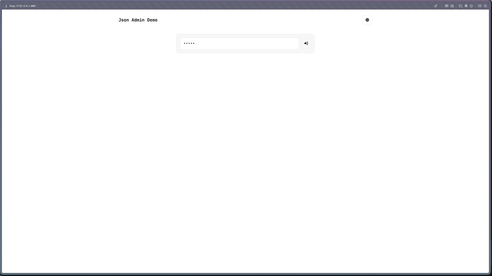
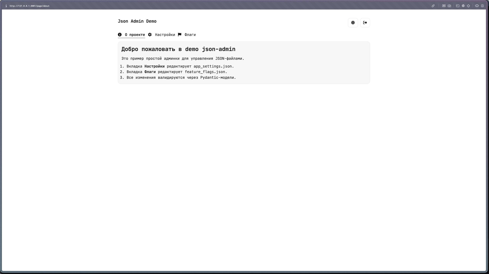
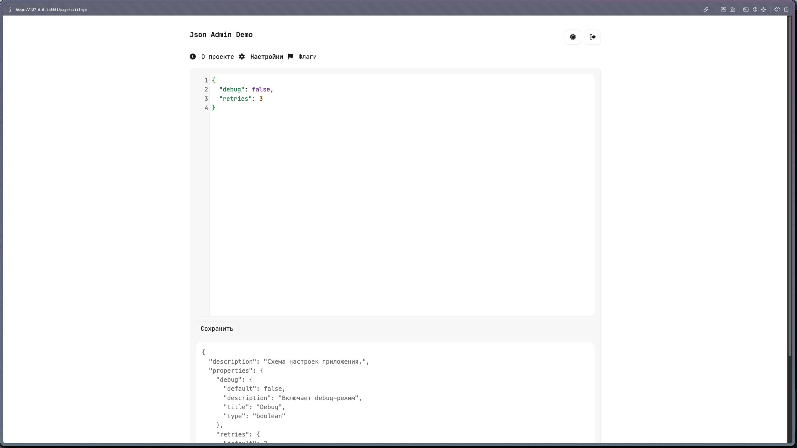

# Json-admin

Библиотека с реализацией простого интерфейса для управления .json-файлом с настройками приложения.

## Установка

```bash
uv add json-admin
```

```bash
poetry add json-admin
```

```bash
pip install json-admin
```

## Быстрый старт

```python
from litestar import Litestar
from pydantic import BaseModel, Field

from jsonadmin import Admin, HtmlPage, JsonPage


class AppSettings(BaseModel):
    """Настройки приложения."""

    debug: bool = Field(default=False, description="Включает debug-режим")
    retries: int = Field(default=3, ge=0, description="Количество повторных попыток")


class FeatureFlags(BaseModel):
    """Настройки флагов."""

    use_cache: bool = Field(default=True, description="Включает кеширование")
    beta_mode: bool = Field(default=False, description="Включает beta-режим")


app = Litestar(route_handlers=[])
admin = Admin(
    app=app,
    passwd="super-strong-password",
    title="My App Admin",
    index="index.html",
    login="login.html",
    pages=[
        HtmlPage(
            slug="info",
            title="Информация",
            icon="fa-solid fa-circle-info",
            content="""
            <h2>Welcome</h2>
            <p>Эта вкладка только для чтения и показывает HTML-блок.</p>
            """,
        ),
        JsonPage(
            slug="settings",
            title="Настройки",
            file_path="data/app_settings.json",
            model=AppSettings,
            icon="fa-solid fa-gear",
            sync_mode="migrate",
        ),
        JsonPage(
            slug="features",
            title="Флаги",
            file_path="data/feature_flags.json",
            model=FeatureFlags,
            icon="fa-solid fa-flag",
            sync_mode="migrate",
        ),
    ],
    base_url="/",
)
```

После запуска:
- `GET /` покажет форму входа по паролю.
- после входа доступны вкладки-страницы с JSON-редактором.
- `HtmlPage` — read-only вкладка с HTML-блоком. `content` может быть:
  встроенной строкой HTML, путём к `.html` файлу или `Callable[[], str]`.
- кнопка `Сохранить` валидирует данные через обязательную Pydantic-модель и сохраняет JSON в файл.
- `sync_mode="create"` создаст JSON-файл при старте, если файла нет.
- `sync_mode="migrate"` создаст файл при отсутствии или прогонит существующий JSON через модель
  (заполнит дефолты и уберет лишние поля, если модель это позволяет).
- файл создается/мигрируется только если модель может быть успешно валидирована; иначе будет ошибка.
- можно переопределить интерфейс через Jinja-шаблоны в `jsonadmin/html/` (по умолчанию) или через `templates_dir=...`.
- для вкладок можно передать `icon` с классом Font Awesome, например `fa-solid fa-gear`.

## Автообновляемый провайдер JSON-конфига

Если в приложении нужен «живой» конфиг, можно использовать `JsonProvider` и `JsonProxy`:

```python
from pydantic import BaseModel, Field

from jsonadmin import JsonProvider, JsonProxy, build_json_model_loader


class AppSettings(BaseModel):
    debug: bool = Field(default=False)
    retries: int = Field(default=3, ge=0)


settings_provider = JsonProvider(
    loader=build_json_model_loader(
        model=AppSettings,
        file_path="data/app_settings.json",
        create_if_missing=True,
    ),
    refresh_interval_sec=5,
)
settings: AppSettings = JsonProxy(settings_provider)  # type: ignore[assignment]

# Использование:
if settings.debug:
    print(settings.retries)
```

`JsonProvider.value` вернет кэш и сам перечитает файл только при истекшем интервале.
`JsonProxy` делает доступ к полям модели прозрачным (`settings.debug`, `settings.retries` и т.д.).

Как с этим работать на практике:
- создайте `loader` через `build_json_model_loader(...)`;
- включите `create_if_missing=True`, если файл нужно создавать автоматически из дефолтов модели;
- оберните `loader` в `JsonProvider` и задайте `refresh_interval_sec`;
- используйте `JsonProxy`, чтобы читать поля как у обычной Pydantic-модели;
- для немедленного обновления можно вызвать `settings_provider.reload()` или `settings.reload()`.

Готовый runnable-пример есть в `examples/provider_demo.py`:

```bash
uv run python examples/provider_demo.py
```

Скрипт показывает сценарий «фонового» обновления: один таск читает прокси, другой изменяет JSON-файл.

## Пример интерфейса

Ниже — короткий визуальный пример того, как выглядит админка:

- Страница входа:
  

- Read-only HTML-вкладка (`HtmlPage`):
  

- Редактирование JSON (вкладка 1):
  

- Редактирование JSON (вкладка 2):
  
